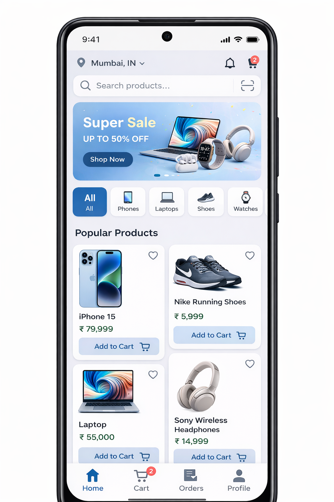

# Ecommerce-Portfolio
# 🛒 E-Commerce Mobile App

A full-stack e-commerce mobile application built using **React Native** and **Firebase**, allowing users to browse products, manage their cart, and place orders in real-time.

---

## 🚀 Features

* 🔐 User Authentication (Firebase Auth)
* 🛍️ Product Listing
* 📄 Product Details
* 🛒 Add to Cart
* 💳 Checkout Flow
* ☁️ Real-time Database (Firestore)

---

## 🛠️ Tech Stack

### Frontend

* React Native
* Expo (optional)

### Backend / Services

* Firebase Authentication
* Firebase Firestore
* Firebase Storage

---

## 📂 Project Structure

```
ecommerce-app/
│── app/            # React Native screens
│── components/     # Reusable components
│── firebase/       # Firebase config
│── assets/         # Images
│── App.js
│── README.md
```

---

## ⚙️ Installation & Setup

```bash
# Clone repo
git clone https://github.com/your-username/ecommerce-app.git

cd ecommerce-app

# Install dependencies
npm install

# Start app
npx expo start
```

---

## 🔑 Firebase Setup

Create a Firebase project and add your config:

```javascript
// firebase/config.js
import { initializeApp } from 'firebase/app';

const firebaseConfig = {
  apiKey: 'YOUR_API_KEY',
  authDomain: 'YOUR_AUTH_DOMAIN',
  projectId: 'YOUR_PROJECT_ID',
  storageBucket: 'YOUR_STORAGE_BUCKET',
  messagingSenderId: 'YOUR_MSG_ID',
  appId: 'YOUR_APP_ID'
};

export const app = initializeApp(firebaseConfig);
```

---

## 💻 Sample Code

### 1. Fetch Products (Firestore)

```javascript
import { getFirestore, collection, getDocs } from 'firebase/firestore';

const db = getFirestore();

const fetchProducts = async () => {
  const querySnapshot = await getDocs(collection(db, 'products'));
  const items = querySnapshot.docs.map(doc => ({ id: doc.id, ...doc.data() }));
  setProducts(items);
};
```

### 2. Add to Cart

```javascript
const addToCart = (product) => {
  setCart((prev) => [...prev, product]);
};
```

### 3. Firebase Auth (Login)

```javascript
import { getAuth, signInWithEmailAndPassword } from 'firebase/auth';

const auth = getAuth();

const login = async (email, password) => {
  try {
    const user = await signInWithEmailAndPassword(auth, email, password);
    console.log(user);
  } catch (error) {
    console.log(error.message);
  }
};


## 📸 Screenshots
## 📱 App Preview




---

## 🚀 Deployment

* Android: Build APK using Expo / React Native CLI
* iOS: Build via Xcode or Expo


## 📬 Contact

GitHub: [https://github.com/your-username](https://github.com/your-username)
